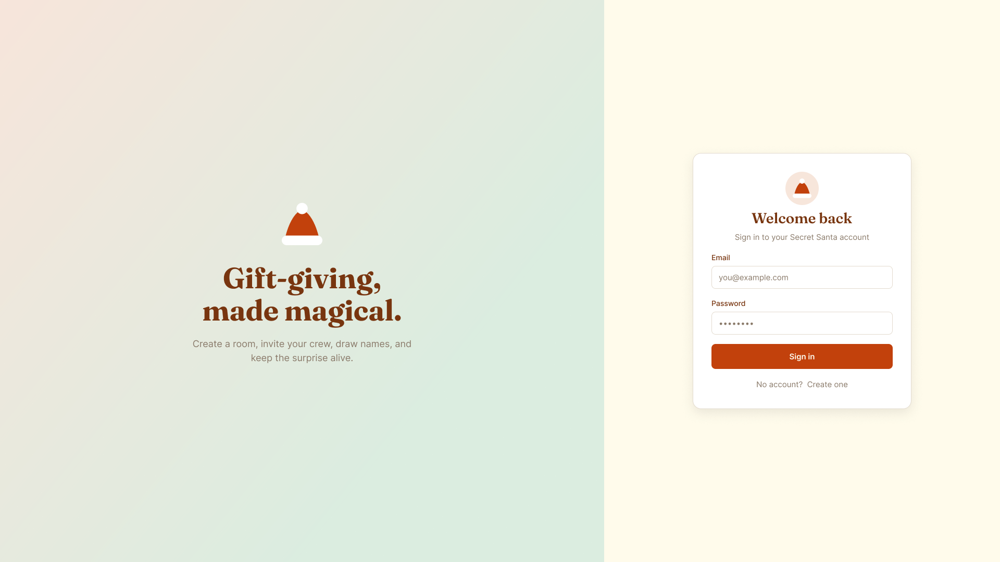

# Secret Santa — Mockups

The visual spec you build the frontend from. These are **mockups to implement**,
not finished code. The baseline ships one worked example (`LoginPage`); you
build the rest of the screens to match these frames, reusing that pattern and
the tokens in [`../design-system.md`](../design-system.md).

> Re-themed from a community "Gift app" reference into the Santa-warm palette
> (red / pine-green / gold on cream). Festive touches: a Santa hat on the login
> badge, snowflakes scattered on the rooms dashboard.

## 👉 Open in Figma (the source of truth)

**[Secret Santa — Mockups](https://www.figma.com/design/vzwQuXGRqBQNUzpMlHtbvR/Secret-Santa-%E2%80%94-Mockups)**
— view access is **open by link**, so just click. This is the canonical,
always-current design with **all 8 screens × mobile + desktop**. Browse every
screen there; the deep links below jump straight to each frame.

> One static preview is kept above just to show the look in-repo. **Everything
> else lives in Figma** (link above) — that's where you inspect screens. No
> Dev Mode needed: exact values are in [`../design-system.md`](../design-system.md)
> + [`../design-tokens.json`](../design-tokens.json), and on a free Figma account
> you can still click a layer to read its fill/font/radius.

## Screens — jump into Figma

All 8 routes have a mobile (390×844) and a desktop (1920×1080) frame, fully
tokenized (fills → `Santa` variables, text → named styles).

| Screen | Mobile frame | Desktop frame |
|--------|--------------|---------------|
| Landing | [37-27](https://www.figma.com/design/vzwQuXGRqBQNUzpMlHtbvR/Secret-Santa-%E2%80%94-Mockups?node-id=37-27) | [42-35](https://www.figma.com/design/vzwQuXGRqBQNUzpMlHtbvR/Secret-Santa-%E2%80%94-Mockups?node-id=42-35) |
| Login | [2-2](https://www.figma.com/design/vzwQuXGRqBQNUzpMlHtbvR/Secret-Santa-%E2%80%94-Mockups?node-id=2-2) | [9-2](https://www.figma.com/design/vzwQuXGRqBQNUzpMlHtbvR/Secret-Santa-%E2%80%94-Mockups?node-id=9-2) |
| Register | [37-2](https://www.figma.com/design/vzwQuXGRqBQNUzpMlHtbvR/Secret-Santa-%E2%80%94-Mockups?node-id=37-2) | [42-2](https://www.figma.com/design/vzwQuXGRqBQNUzpMlHtbvR/Secret-Santa-%E2%80%94-Mockups?node-id=42-2) |
| Rooms (dashboard) | [4-2](https://www.figma.com/design/vzwQuXGRqBQNUzpMlHtbvR/Secret-Santa-%E2%80%94-Mockups?node-id=4-2) | [10-2](https://www.figma.com/design/vzwQuXGRqBQNUzpMlHtbvR/Secret-Santa-%E2%80%94-Mockups?node-id=10-2) |
| Room detail (draw) | [33-2](https://www.figma.com/design/vzwQuXGRqBQNUzpMlHtbvR/Secret-Santa-%E2%80%94-Mockups?node-id=33-2) | [43-2](https://www.figma.com/design/vzwQuXGRqBQNUzpMlHtbvR/Secret-Santa-%E2%80%94-Mockups?node-id=43-2) |
| Messages (chat) | [34-2](https://www.figma.com/design/vzwQuXGRqBQNUzpMlHtbvR/Secret-Santa-%E2%80%94-Mockups?node-id=34-2) | [44-2](https://www.figma.com/design/vzwQuXGRqBQNUzpMlHtbvR/Secret-Santa-%E2%80%94-Mockups?node-id=44-2) |
| Notifications | [36-2](https://www.figma.com/design/vzwQuXGRqBQNUzpMlHtbvR/Secret-Santa-%E2%80%94-Mockups?node-id=36-2) | [45-2](https://www.figma.com/design/vzwQuXGRqBQNUzpMlHtbvR/Secret-Santa-%E2%80%94-Mockups?node-id=45-2) |
| Profile | [36-41](https://www.figma.com/design/vzwQuXGRqBQNUzpMlHtbvR/Secret-Santa-%E2%80%94-Mockups?node-id=36-41) | [45-54](https://www.figma.com/design/vzwQuXGRqBQNUzpMlHtbvR/Secret-Santa-%E2%80%94-Mockups?node-id=45-54) |

## Per-screen icons & app parity

Each screen uses specific [lucide](https://lucide.dev) icons (nav + in-content),
all available via the `lucide-react` dependency — the route→icon map is in
`src/components/layout/navItems.ts`. See **[`ALIGNMENT.md`](ALIGNMENT.md)** for the
full per-screen icon inventory and the list of Figma frame edits that bring the
mockups in line with the built app (e.g. the Messages two-chat toggle).

## Responsive contract

- **Mobile:** single column, fixed top bar, bottom tab navigation.
- **Desktop:** left sidebar navigation (logo + nav + user block), main content
  area with a wrapping card grid; auth/landing use a split hero + form layout.

This matches the shell already wired in the baseline (`AppLayout` →
`Sidebar` on `md+`, `BottomNav` below). See `../design-system.md` §6.

## Note

Only `preview.png` is kept in-repo (a single static cover). The full, current
design is the **Figma file** linked above — inspect screens there, not from
committed images.
